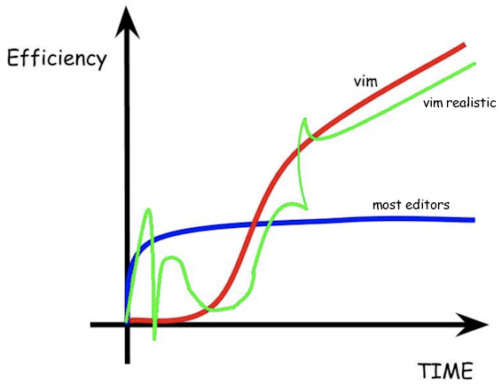

# 2021-02-10 FbW41-2 Useful Time-Fill: Edward's Tips

## 1. Will Stern's Big Picture of Web Development

- Mind map of your entire web-development learnscape: https://coggle.it/diagram/XfeRbWj7xy3dsEX8/t/web-development-in-2020
    - overwhelming but useful
    - *"Don't lose the forest for the trees."* :evergreen_tree::evergreen_tree::evergreen_tree:
    - *"Begin with the end in mind."* - Stephen Covey, Habit 2
- 30 min video: https://www.youtube.com/watch?v=SBB1YtwODT0
    - Will Stern is a no-nonsense speaker: clear, honest, opinionated 
    - says things like: 
		- *"JAMstack on Netlify is the new WordPress."*
		- *"The three main JavaScript frameworks are React, Vue.js, Angular. Learn React, explore Vue when you have time, forget Angular."*
		- insightful statements to explore and argue out

## 2. Learn something about the cloud every day

- cloud skills = job security
- step 1: learn the lingo
    - AWS: https://onespace.netlify.app/techItems?id=292
    - Azure: https://onespace.netlify.app/techItems?id=314
    - GCP: https://onespace.netlify.app/techItems?id=326

## 3. Create a dogfooding project

- **dogfood**, v. to use your own product

- ideas:
    - create a **website to store useful code, links, information** that is easily searchable via web and mobile devices
        - https://onespace.netlify.app
    - create a **framework** that helps you build software faster and more efficiently
        - https://tanguay.info/datapod
    - create a **real project** with technology you are learning, a project you actually use for real-world needs, i.e. one that would make you (or someone else) sad or mad if it doesn't work and one you constantly improve to make your life (or someone else's life) better
        - something you will constantly use and want to improve
        - get skin in the game: a website for a business or group that actually uses it

## 4. Secret efficiency tip from 1976: The vim editor

- **vi**, created by Bill Joy in 1976: https://en.wikipedia.org/wiki/Vi
    - rich text editing commands without a mouse
    - *"Everyone's first experience with the vi editor is when they realize they're in it and can't get out."*
- **vim**, ("Vi IMproved") created by Bram Moolenaar in 1991: https://en.wikipedia.org/wiki/Vim_(text_editor)
    - color syntax
    - multi-level undo
    - macros
    - visual mode (block selecting, etc.)
    - multiple windows
    - much more
- advantages of vim
    - **it's installed everywhere**: Linux, Mac, Windows (comes with Git bash)
    - **non-GUI rich editing** (when logged in via SSH, telnet, etc.)
    - it will **improve your efficiency** in the long run (hands always on home keys)
    - **Visual Studio Code + vim** :heart: (via plugin: *Vim emulation for VSCode*)
- disadvantages of vim
    - ***it's frustrating as hell to learn!***

- speed tour of vim:
    * h,j,k,l
    * first two modes: motion mode, insert mode
    * i, I, a, A, o, O
    * dd, yy, p, P, (preceding numbers)
    * dw, diw, cw, ciw
    * w and b
    * search: /, ?, n, CTRL-o
    * x, r, s
    * gg, G, gt
    * visual mode: v, V, CTRL-V
    * gcc to comment line
    * . to repeat an action (change - to *)
    * macros: qa, q, @a, 11@a
	* H, M, L
- cheat sheet: https://vim.rtorr.com
- force yourself to use it for two weeks, you'll thank yourself later