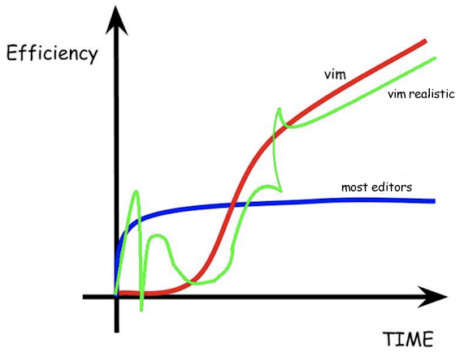

# What Works

length: `30 min` presentation
goal: convince participants to use the vim plugin for VSCode

## Increase your coding speed and efficiency by using vim in Visual Studio Code 

- **vi**, created by Bill Joy in 1976: https://en.wikipedia.org/wiki/Vi
    - rich text editing commands without a mouse
    - *"Everyone's first experience with the vi editor is when they realize they're in it and can't get out."*
- **vim**, ("Vi IMproved") created by Bram Moolenaar in 1991: https://en.wikipedia.org/wiki/Vim_(text_editor)
    - color syntax
    - multi-level undo
    - macros
    - visual mode (block selecting, etc.)
    - multiple windows
    - much more
- advantages of vim
    - **it's installed everywhere**: Linux, Mac, Windows (comes with Git bash)
    - **non-GUI rich editing** (when logged in via SSH, telnet, etc.)
    - it will **improve your efficiency** in the long run (hands always on home keys)
    - **Visual Studio Code + vim** :heart: (via plugin: *Vim emulation for VSCode*)
- disadvantages of vim
    - ***it's frustrating as hell to learn!***

- speed tour of vim:
    * h,j,k,l
    * first two modes: motion mode, insert mode
    * i, I, a, A, o, O
    * dd, yy, p, P, (preceding numbers)
    * dw, diw, cw, ciw
    * w and b
    * search: /, ?, n, CTRL-o
    * x, r, s
    * gg, G, gt
    * visual mode: v, V, CTRL-V
    * gcc to comment line
    * . to repeat an action (change - to *)
    * macros: qa, q, @a, 11@a
	* H, M, L
- cheat sheet: https://vim.rtorr.com
- force yourself to use it for two weeks, you'll thank yourself later